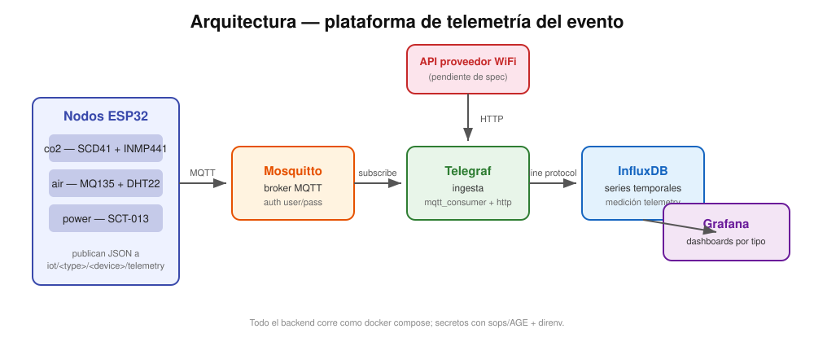

# Plataforma de telemetría — diseño

> Backend distribuido para el evento en vivo. Nodos heterogéneos sobre WiFi inestable, datos idempotentes, dashboards por tipo de nodo.



## 1. Objetivo y alcance

Recibir datos de un conjunto de nodos de sensores desplegados en un predio durante un evento, y exponerlos en dashboards. Requisitos de diseño:

- **Nodos heterogéneos** que puedan crecer en cantidad y tipos sin tocar el backend.
- **Red inestable**: se tolera pérdida de datos (con tal de que la mayoría del tiempo funcione).
- **Idempotente**: reenvíos no deben duplicar lecturas.
- **Desplegable en un servidor provisto**, con variables de ambiente.
- **Dashboards por caso** (CO2, calidad de aire, energía, WiFi).

## 2. Arquitectura

```
nodos ESP32 --MQTT/TLS:443--> Mosquitto --Telegraf--> InfluxDB --Grafana--> dashboards
                                  ^
API WiFi (servidor) ---HTTP-------+
```

- **Nodos** publican JSON a MQTT **sobre TLS (puerto 443, el que el predio deja salir)** con **auth user/pass**. No saben nada del backend: solo su `type`, su `device`, el hostname del broker y sus credenciales.
- **Mosquitto** es el único punto que los nodos conocen. Con autenticación user/pass.
- **Telegraf** hace toda la ingesta de forma declarativa: `mqtt_consumer` para nodos y `inputs.http` para la API del proveedor WiFi (del lado servidor, sin nodo).
- **InfluxDB** almacena series (sin puerto público); **Grafana** muestra un dashboard por tipo más un overview, **expuesto por Cloudflare Tunnel** (sin abrir puertos).

El backend corre en una **VM en la nube** (AWS), provisionada con **Ansible**: `docker compose` + `direnv` + `sops/AGE`. Cert **Let's Encrypt** en 443 (CA a cargar en el nodo: **ISRG Root X1**).

## 3. Taxonomía de nodos

Cada nodo tiene un `type` y un `device` (id único). El `type` define qué fields manda.

### 3.1 `co2` — SCD4x + INMP441

CO₂, temperatura, humedad y nivel de ruido. **Construido y funcionando.** El firmware que
corre en la flota es `firmware/node-co2-calib/` (agrega Leq + A-weighting y compensación de
temperatura); `node-co2.ino` queda como variante vieja ("solo offset").

El sensor es un **SCD4x**: SCD40 o SCD41, intercambiables (misma librería y pinout). En la
flota, `co2-01` usa SCD41 y el resto SCD40.

| field | unidad | sensor |
|-------|--------|--------|
| `co2_ppm` | ppm | SCD4x |
| `temp_c` | °C | SCD4x |
| `hum_pct` | % | SCD4x |
| `noise_dbfs` | dBFS | INMP441 |
| `noise_l90` / `noise_l10` | dBFS | INMP441 (percentiles de Leq) |
| `rssi_dbm` / `wifi_reconn` | dBm / n | salud del enlace WiFi |

Puede haber varios nodos `co2`. Se distinguen por `device`.

### 3.2 `air` — MQ135 + DHT22

**Experimento** (no va en el evento): comparar la respuesta del MQ135 con los SCD4x reales.
El MQ135 es analógico y **no selectivo**: las 5 "curvas" de gas salen del **mismo Rs** y se
mueven juntas, así que las ppm derivadas son un display aproximado, no 5 mediciones. En línea
con la investigación del CONICET sobre sensores de bajo costo. Se publica el `air_raw` crudo
además de lo derivado, para poder recalibrar sin reflashear.

| field | unidad | nota |
|-------|--------|------|
| `air_raw` | ADC | crudo, para recalibrar |
| `co2_ppm`, `co_ppm`, `alcohol_ppm`, `nh3_ppm`, `toluene_ppm` | ppm | derivadas del mismo Rs (curvas log-log del datasheet), suavizadas con EWMA |
| `temp_c` | °C | DHT22 |
| `hum_pct` | % | DHT22 |

`calibrateR0()` corre **en el nodo** al arrancar, asumiendo aire limpio (~400 ppm) → conviene
encender el nodo en aire fresco.

### 3.3 `power` / `volt` — SCT-013 + enchufe Tuya

Dos fuentes **complementarias**:
- Nodo `power` (`firmware/node-power/`): pinza **SCT-013** + **ADS1115** (I2C). Mide la **corriente** de un circuito.
- Publisher `volt` (`tuya-publisher/`, Python por LAN): enchufe medidor **Tuya**, aporta la **tensión** real.

La potencia del circuito se aproxima como **aparente**: `VA = V(enchufe) × I(pinza)` — calculado **en Grafana**, no en el publisher. No son W reales (falta el factor de potencia). El enchufe, además, publica el V/A/W **de su propia carga**.

| tipo | field | unidad | nota |
|------|-------|--------|------|
| `power` | `current_a` | A | SCT-013 (RMS), un circuito |
| `volt` | `voltage_v` | V | tensión del enchufe |
| `volt` | `current_a` | A | propia carga del enchufe |
| `volt` | `power_w` | W | propia carga del enchufe (real) |

Alcance: una pinza = un circuito. El total del predio necesita una pinza por fase. Para W reales por circuito, sensor de tensión en el mismo nodo. **VA (aparente del circuito) y kVAh se derivan en Grafana** (`voltage_v` × `current_a`), no son campos publicados.

### 3.4 `wifi` — API del proveedor

**No es un nodo**: lo consulta Telegraf desde el servidor (`inputs.http`). Sin especificación de la API todavía — queda como plantilla parametrizada (URL + token por entorno).

## 4. Modelo de datos

Topic: `iot/<type>/<device>/telemetry`.

Payload (una medición, todas las métricas del nodo en el mismo JSON):

```json
{"type":"co2","device":"co2-01","seq":1234,"ts":1756000000,
 "co2_ppm":654,"temp_c":19.3,"hum_pct":59.3,"noise_dbfs":-48.3}
```

Reglas:

- `type` y `device` → **tags** de InfluxDB (Telegraf `tag_keys`).
- `ts` → **timestamp** de InfluxDB (Telegraf `json_time_key`), en segundos Unix desde el nodo.
- `seq` → contador monótono por nodo, queda como field para detectar huecos.
- El resto → **fields**.

Medición única `telemetry`. Agregar un tipo de nodo nuevo = nuevos fields con su tag `type`; no se toca el backend.

## 5. Fiabilidad e idempotencia

- **Timestamp en origen** (NTP en el nodo): el orden temporal es correcto aunque el mensaje llegue tarde o desordenado.
- **Idempotencia por InfluxDB**: puntos idénticos (misma serie + timestamp) se sobrescriben. Reenvíos no duplican.
- **`seq` monótono**: en el dashboard se ve si un nodo dejó de mandar o perdió lecturas (huecos en la secuencia).
- **QoS 0** (PubSubClient no implementa 1/2) + reconexión automática WiFi/MQTT en cada nodo. Pérdida aceptada por diseño.
- **Store-and-forward**: además del envío en vivo, cada nodo encola las lecturas en RAM (con
  snapshot periódico a LittleFS para sobrevivir un reboot/brownout) y las drena de a poco.
  Como cada lectura viaja con su `ts` original, las atrasadas rellenan en el tiempo correcto.
- **Suavizado EWMA**: el SCD4x tiene ruido propio (~±2-3 ppm); se publica un promedio móvil
  (α≈0.3), consistente entre nodos.

## 6. Seguridad

- **MQTT sobre TLS en el puerto 443** (cert Let's Encrypt, cadena anclada en **ISRG Root X1** = la CA que valida el nodo).
- MQTT con **autenticación user/pass** (predio público: evita que cualquiera publique basura).
- **InfluxDB sin puerto expuesto** al host: solo accesible por la red interna de Docker (Telegraf y Grafana).
- **Grafana** por **Cloudflare Tunnel** (sin puerto público), con password fuerte desde los secretos.
- Secretos **cifrados con sops/AGE**, descifrados en memoria por `direnv`.

## 7. Despliegue

Ver `README.md`. Resumen:

1. `direnv allow`
2. Crear y cifrar `secrets.enc.yaml` (sops + AGE).
3. `./scripts/gen-mqtt-passwd.sh` (hash para mosquitto).
4. `docker compose up -d`.

Los nodos se configuran por separado: cada uno lleva en su `secrets.h` el SSID/pass WiFi, el `BROKER_IP`, el `MQTT_USER`/`MQTT_PASS`, su `type` y su `device`.

## 8. Dashboards

Provisionados en `grafana/provisioning/dashboards/`:

- `overview.json` — último valor por nodo (gauges de CO₂ y ruido, stats de T/H), una fila por `device`.
  > Se evaluó una vista de *salud por `seq`* (detectar nodos caídos por el contador), pero se
  > descartó: las consultas continuas castigaban el router del predio.
- `overview-grid.json` — grilla de gauges por nodo CO2.
- `co2.json` — CO₂, temperatura, humedad y ruido (incluye `noise_l90`/`noise_l10`).
- `air.json` — MQ135 crudo + derivado, T/H.
- `power.json` — corriente (pinza, `type=power`), tensión (`type=volt`) y **aparente derivada en Grafana**: `VA = V × I` y `kVAh` (integral), con join de las dos series sobre buckets de **10s**.
- (`wifi.json` eliminado; se recreará cuando exista la API.)

## 9. No construido / pendientes

- **API del proveedor WiFi**: sin documentación. Telegraf tiene el placeholder; hay que completar `inputs.http` y el dashboard `wifi`.
- **Nodo `air`**: **HECHO** (MQ135 + DHT22, el DHT22 al revés era el problema).
- **Nodo `power`**: **HECHO** (SCT-013 + ADS1115 publica `current_a`); tensión desde el enchufe Tuya (`tuya-publisher`). Ver 3.3.
- **Calibración del MQ135** contra el SCD41: por hacer en el backend.
- **MQTT con TLS: HECHO** — TLS en 443 (Let's Encrypt, ISRG Root X1) + auth user/pass, verificado (`CONNACK 0` desde internet).
- **Deploy: HECHO** — desplegado en VM AWS con Ansible; Grafana por Cloudflare Tunnel. Falta probarlo contra la red real del predio.
- **Dependencia de red del predio (a confirmar):** desde la red de los nodos deben salir **443** (MQTT/TLS), **53** (DNS, para resolver el hostname del broker) y **123** (NTP, o el TLS falla por fechas del cert). Si es "solo 443", DNS y NTP necesitan alternativa (DoH / IP fija; hora por otra vía).

## 10. Roadmap sugerido

1. ~~Validar el backend end-to-end con el nodo `co2`~~ **HECHO**.
2. ~~Adaptar los nodos `air` y `power` al schema/topic~~ **HECHO**; falta apuntar los paneles de V/W de `power.json` a `volt`.
3. Definir y conectar la API WiFi (Telegraf `inputs.http` + dashboard).
4. ~~Desplegar en el servidor del evento~~ **HECHO** (Ansible); falta probar contra la red real del predio.
